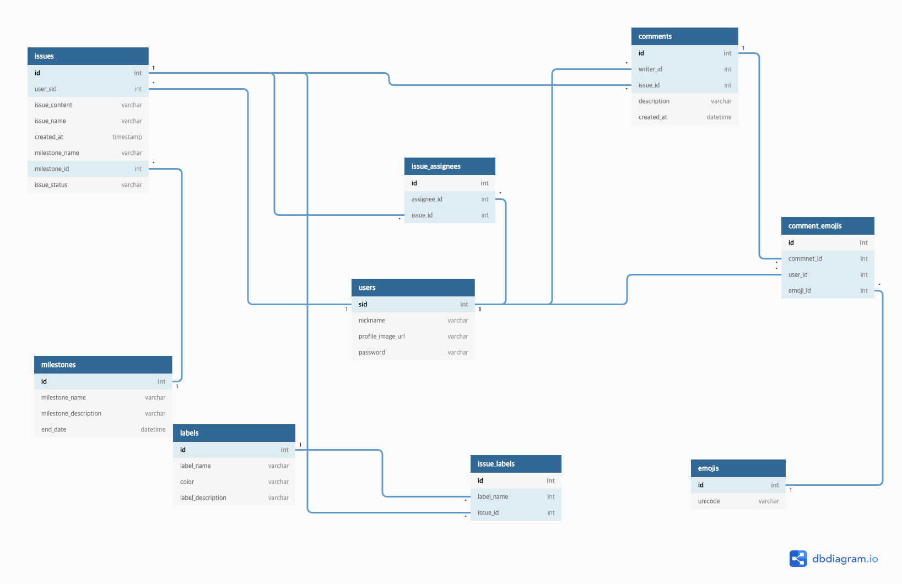

# IssueTracker-2

## 🎨 Team Pastel

 

 

 

## 팀원

 

&nbsp;&nbsp;&nbsp;&nbsp;&nbsp;&nbsp;&nbsp;<strong>[J034 김민섭](https://github.com/msmk530)</strong>
&nbsp;&nbsp;&nbsp;&nbsp;&nbsp;&nbsp;&nbsp;<strong>[J127 유현우](https://github.com/puba5)</strong>
&nbsp;&nbsp;&nbsp;&nbsp;<strong>[J161 이지은](https://github.com/zlrlo)</strong>
&nbsp;&nbsp;&nbsp;&nbsp;&nbsp;&nbsp;&nbsp;&nbsp;<strong>[S023 서명렬](https://github.com/fElix-MR)</strong>
&nbsp;&nbsp;&nbsp;&nbsp;&nbsp;&nbsp;&nbsp;&nbsp;&nbsp;&nbsp;<strong>[S054 조송주](https://github.com/songjucho)</strong>

 

 

## 프로젝트 소개

> GitHub Issue 클론 프로젝트입니다.

 

### 개발 환경

 

### 배포
[배포사이트](http://101.101.218.59:8080/)

### 작업 진행 상황

 

## 프로젝트 상세

[Backlog](https://docs.google.com/spreadsheets/d/1X5dBBIllFMjnaLvKmocZAZ3RWysQW1DdZlQlCsELIT0/edit?ts=5f9a4a1c#gid=1554475908)

[Wiki](https://github.com/boostcamp-2020/IssueTracker-2/wiki)

### Database Diagram

 

### 주요 기능

### OAuth Login (GitHub)
> GitHub 계정으로 로그인 가능

### Label
> Label 추가, 수정, 삭제 가능

### Milestone
> Milestone 추가, 수정, 삭제, Open/Close 가능

### Issue
> Issue 추가 가능, 마크다운 Preview 기능 지원

